<p align="center">
  
</p>

<h1 align="center">Akili</h1>

<p align="center">
  After-School Learning App for Everyone
</p>

<p align="center">
  <a href="#download"></a>
  <a href="#download"></a>
  <a href="#download"></a>
  <br>
  
</p>

---

## Download

| Platform | Download | Notes |
|:--------:|:--------:|:------|
| 🌐 **Web** | [**akili.kiri.ng**](https://akili.kiri.ng) | Works in any modern browser |
| 🪟 **Windows** | [**Akili_Setup.exe**](https://github.com/Nwokike/akili-app/releases/latest/download/Akili_Setup.exe) | Windows 10/11 64-bit Installer |

### Android

| Variant | Download | Size |
|:--------|:--------:|:-----|
| 📦 **Universal APK** | [**akili.apk**](https://github.com/Nwokike/akili-app/releases/latest/download/akili.apk) | All architectures |
| 📱 **ARM64** (most phones) | [**akili-arm64-v8a.apk**](https://github.com/Nwokike/akili-app/releases/latest/download/akili-arm64-v8a.apk) | Modern 64-bit devices |
| 📱 **ARMv7** (older phones) | [**akili-armeabi-v7a.apk**](https://github.com/Nwokike/akili-app/releases/latest/download/akili-armeabi-v7a.apk) | 32-bit ARM devices |
| 💻 **x86_64** (emulators) | [**akili-x86_64.apk**](https://github.com/Nwokike/akili-app/releases/latest/download/akili-x86_64.apk) | Chromebooks & emulators |

---

## Core Capabilities

| Capability | Description |
|:---|:---|
| **Curriculum Generator** | AI-powered course outlines tailored to your education level and country. Generates structured modules with topic-by-topic breakdowns. |
| **Smart Lessons** | Detailed, step-by-step lessons with learning objectives, explanations, examples, and practice problems. Cached locally for offline reading. |
| **Interactive Quizzes** | Auto-generated multiple-choice assessments with instant feedback. Always free. |
| **Mock Exams** | Timed full-length assessments with automatic grading and performance analytics. |
| **AI Tutor** | Chat with an AI tutor that answers questions with web-sourced, cited explanations. Supports voice input and image attachments. |
| **Gamification** | XP, levels (Freshman → Genius), daily streaks, and achievement badges to keep you motivated. |

---

## Screenshots

### Desktop Experience

<p align="center">
  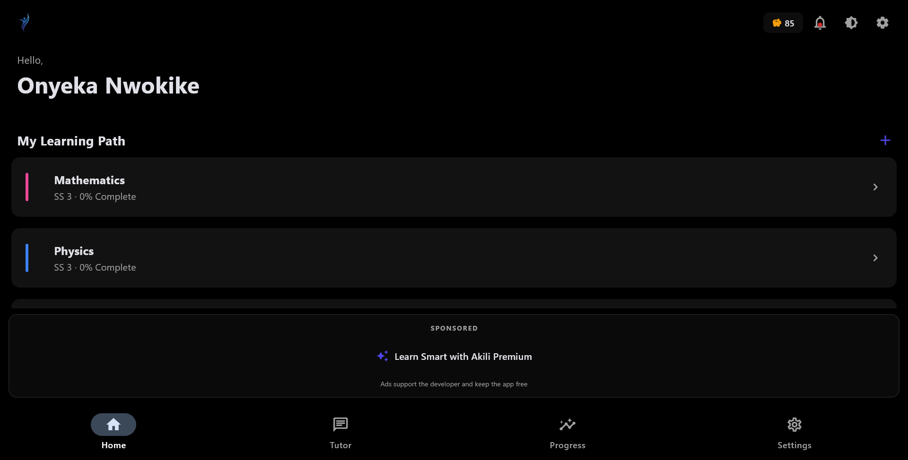
</p>
<p align="center"><em>Home Dashboard — view enrolled courses, progress, and quick-access to AI Tutor</em></p>

<p align="center">
  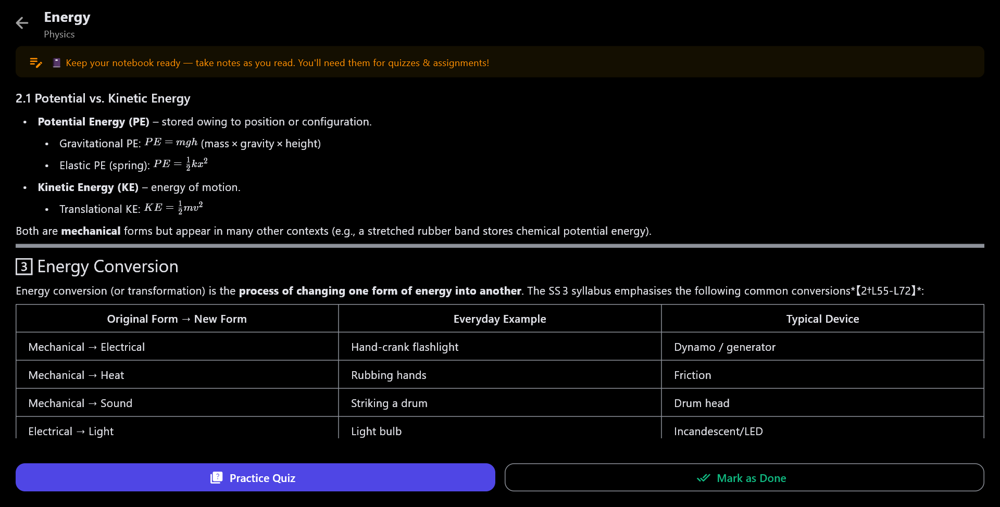
</p>
<p align="center"><em>Course Details — module-by-module learning path with progress tracking and assignment indicators</em></p>

<p align="center">
  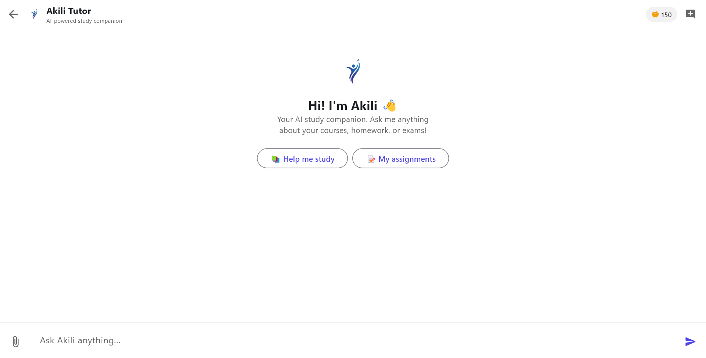
</p>
<p align="center"><em>AI Tutor — streaming chat with full student context, video card embeds, voice notes, and image uploads</em></p>

<p align="center">
  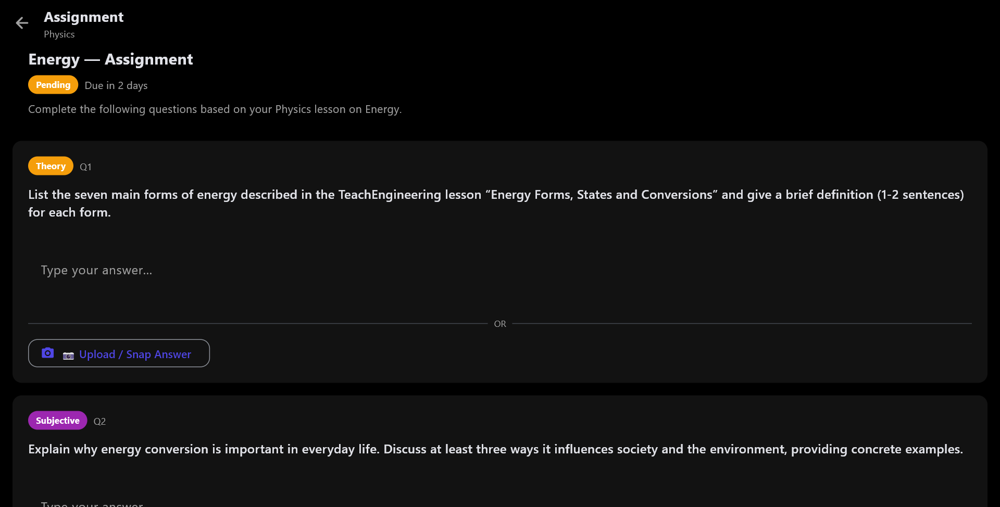
</p>
<p align="center"><em>Assignment View — type or snap handwritten answers, AI-graded with per-question feedback</em></p>

<table>
  <tr>
    <td width="50%">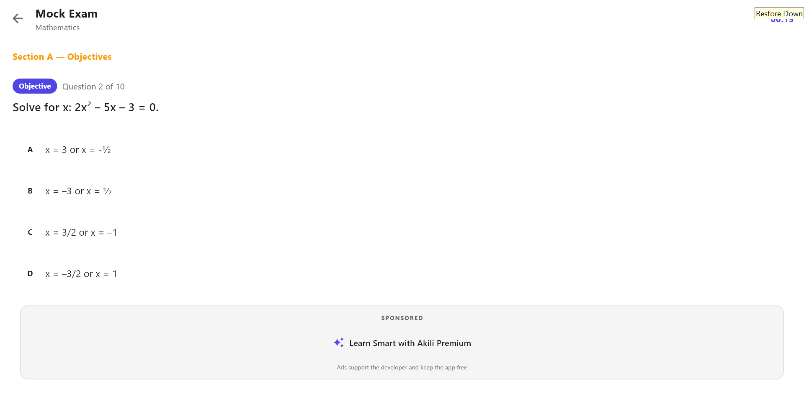</td>
    <td width="50%">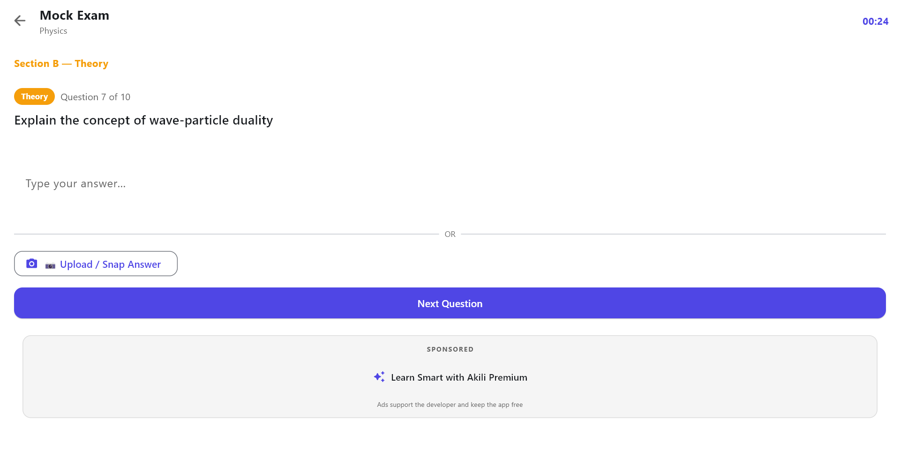</td>
  </tr>
  <tr>
    <td align="center"><em>Mock Exam Section A — timed objective questions with instant feedback</em></td>
    <td align="center"><em>Mock Exam Section B — theory questions with typed or image upload answers</em></td>
  </tr>
</table>

<table>
  <tr>
    <td width="50%">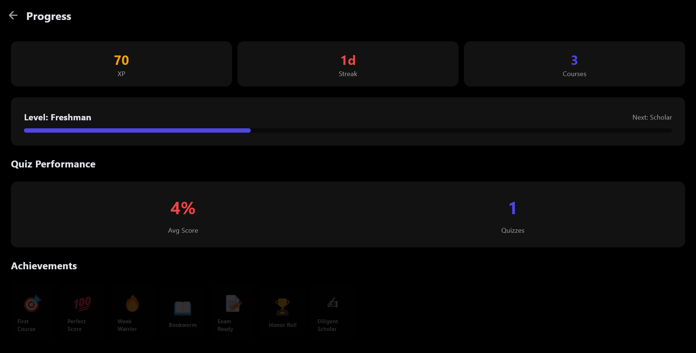</td>
    <td width="50%">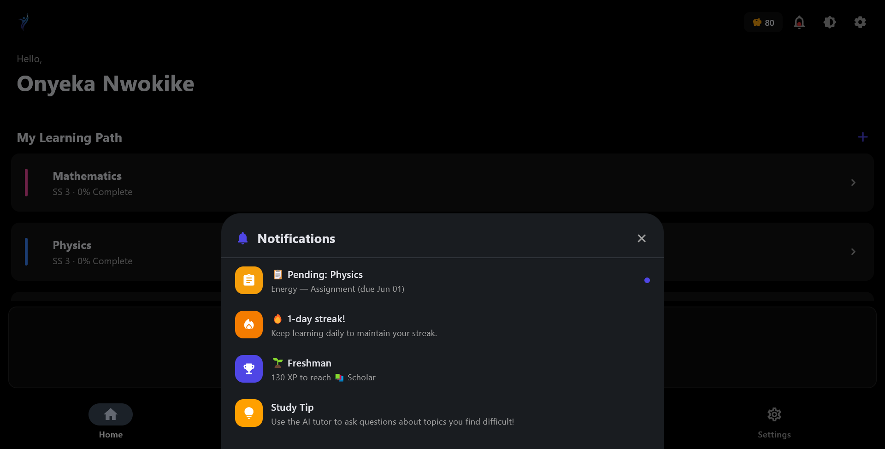</td>
  </tr>
  <tr>
    <td align="center"><em>Progress & Achievements — XP, streaks, quiz stats, badges, and shareable milestones</em></td>
    <td align="center"><em>Notification Panel — pending assignments, daily credits, streak reminders, and study tips</em></td>
  </tr>
</table>

### Mobile Experience

<table>
  <tr>
    <td width="33%">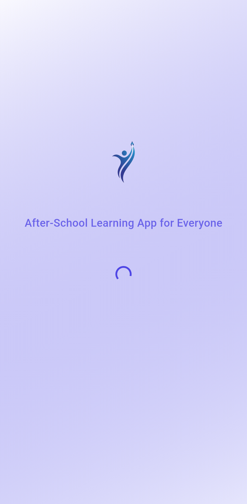</td>
    <td width="33%">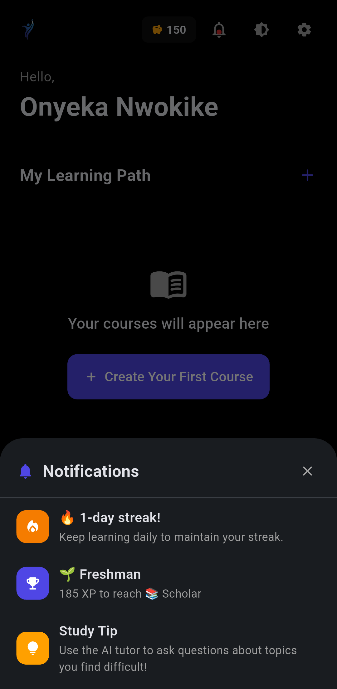</td>
    <td width="33%">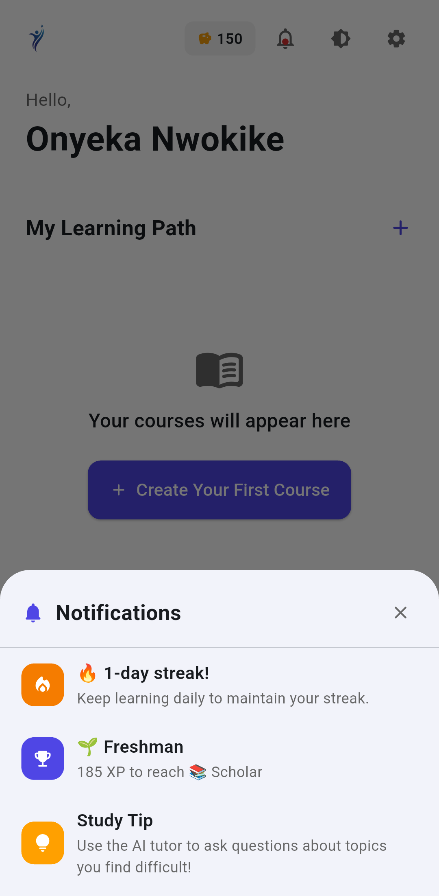</td>
  </tr>
  <tr>
    <td align="center"><em>Animated Splash — brand logo with auto-navigation to dashboard or onboarding</em></td>
    <td align="center"><em>Home Dashboard (Dark) — notification badges, credit balance, course list with colored indicators</em></td>
    <td align="center"><em>Home Dashboard (Light) — empty state with create-first-course call-to-action</em></td>
  </tr>
</table>

<table>
  <tr>
    <td width="50%">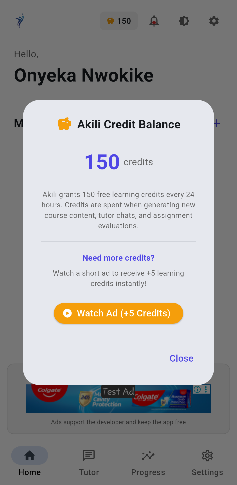</td>
    <td width="50%">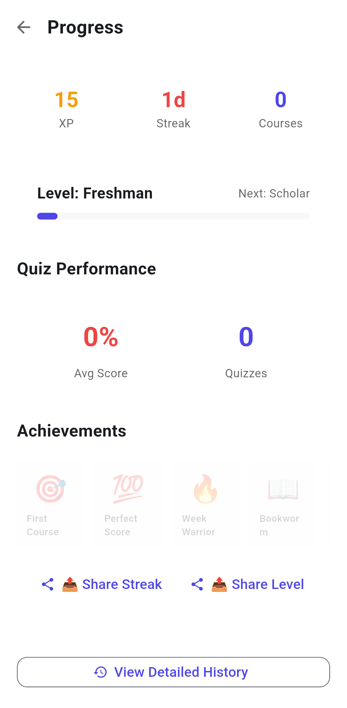</td>
  </tr>
  <tr>
    <td align="center"><em>Credit Balance Panel — view daily allowance, watch rewarded ads for +5 bonus credits (30s cooldown)</em></td>
    <td align="center"><em>Empty State — welcoming first-time users with guided course creation flow</em></td>
  </tr>
</table>

---

## Features

- **Credit System** — 150 daily credits for AI actions. Practice quizzes are always free.
- **Offline-First** — SQLite with WAL mode. Lessons cached locally after first generation.
- **Dark Mode** — System-aware dark/light theme switching.
- **Cross-Platform** — Works on Android, Windows, and Web with the same experience.
- **Voice Input** — Record voice notes; automatically transcribed and sent to your AI tutor.
- **Image Analysis** — Upload photos of assignments; AI extracts and explains the content.

---

## Architecture

| Layer | Technology | Purpose |
|:---|:---|:---|
| **Frontend** | Flet | Reactive cross-platform UI |
| **AI Gateway** | akili-gateway.kiri.ng | Multi-model AI orchestration with automatic failover |
| **Database** | SQLite (WAL mode) | Async local storage with aiosqlite |
| **Search** | Bing | Web content retrieval for curriculum research |
| **Network** | httpx | Async HTTP with connection pooling |

### Visual Flow

```text
┌─────────────────────────────────────────────────────┐
│                     AKILI APP                        │
│  ┌──────┐ ┌──────────┐ ┌───────┐ ┌──────┐ ┌──────┐ │
│  │ Home │ │ Courses  │ │ Tutor │ │Progress│ │Settings│
│  └──┬───┘ └────┬─────┘ └──┬────┘ └──┬───┘ └──┬───┘ │
│     │          │          │         │         │     │
│  ┌──┴──────────┴──────────┴─────────┴─────────┴──┐  │
│  │         Local SQLite (aiosqlite, WAL)          │  │
│  └──────────────────────┬─────────────────────────┘  │
└─────────────────────────┼───────────────────────────┘
                          │ HTTPS (akili-gateway.kiri.ng)
                          ▼
┌─────────────────────────────────────────────────────┐
│             AI GATEWAY (Cloudflare Worker)            │
│              Multi-model inference routing            │
└─────────────────────────────────────────────────────┘
```

---

## Credit System

| Action | Credits |
|--------|---------|
| Course Creation | 15 |
| Lesson Generation | 5 |
| Mock Exam | 10 |
| Tutor Question | 2 |
| **Practice Quiz** | **FREE** |

**150 credits/day** — resets at midnight. Always free to practice.

---

## Privacy & Security

Akili is designed with a **Privacy-First** philosophy for educational data.

1. **Local Storage**: Your course progress, lessons, and quiz history are stored entirely on your device.
2. **Encryption**: All communication with the AI gateway is encrypted via TLS.
3. **No Data Retention**: Raw uploaded images and voice recordings are processed ephemerally — only the extracted text is used.
4. **No Account Required**: Use immediately without creating an account or providing personal data.

---

## Legal Disclaimer

Akili is an AI-powered educational tool. While it uses advanced AI to generate curricula, lessons, and assessments, users are responsible for verifying the accuracy and appropriateness of generated content against official curriculum standards. Akili does not replace certified educators or official curriculum documents. The AI may occasionally produce inaccurate information — always cross-reference with authoritative sources.
